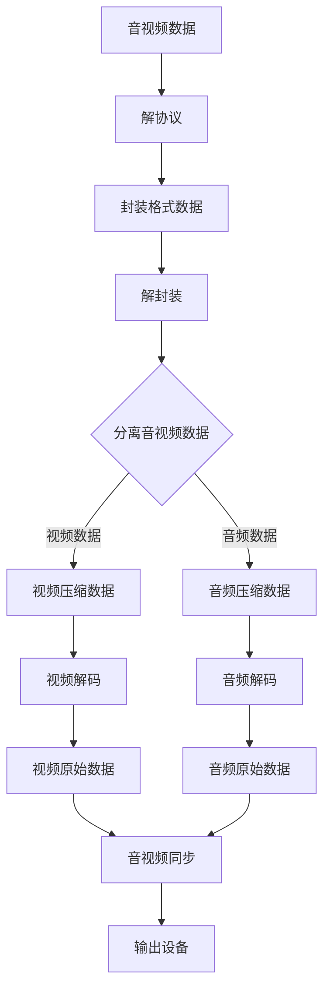

# 音视频学习笔记

主要来自[雷神（雷霄骅先生）的入门博客](https://blog.csdn.net/leixiaohua1020/article/details/18893769)，

## 1. 播放视频

- 解协议：将流媒体协议数据，解析为标准的相应的封装格式数据。常见的流媒体协议有HTTP、RTMP、MMS等。比如RTMP传输的数据，解协议操作后输出FLV数据。
- 解封装：将输入的封装格式数据，分离成为音频流压缩编码数据和视频流压缩编码数据。常用的封装格式如MP4、MKV、RMVB、TS、FLV、AVI等。比如FLV数据解封装后，输出H.264编码的视频码流和AAC编码的音频码流。
- 解码：将音视频压缩编码的数据，解码为非压缩的音视频原始数据。常见的音频压缩编码标准有AAC、MP3、AC-3等，视频压缩编码标准则包含H.264、MPEG2、VC-1等。这是整个系统中最重要也是最复杂的一个环节，解码后输出为未压缩的颜色数据，如YUV420P、RGB等。
- 视音频同步：根据解封装模块处理过程中得到的参数信息，同步解码出来的视频和音频数据，将音频数据发送至声卡，视频发送至显卡播放出来。

## 资源下载链接

- [FFmpeg](https://www.ffmpeg.org/download.html)

  FFmpeg 是一个自由软件（PS:反正就是非常牛逼），可以运行音频和视频多种格式的录影、转换、流功能，包含了

  - libavcodec：用于多个项目中音频和视频的解码器库
  - libavformat：音频与视频格式转换库。

- [yuvplayer](https://sourceforge.net/projects/raw-yuvplayer/)

  一款开源的，能够查看YUV和RGB格式图像和视频的软件

- [Audacity](https://www.audacityteam.org/)

  一款开源的免费的音频处理软件，遵循GNU协议的免费软件

所有文中用到的音视频资源都可以在我的Github下载

- [项目地址](https://github.com/jo-qzy/AudioVideoLearning)

## 音视频格式处理

- [音视频学习：YUV](YUV.md)
- [音视频学习：RGB](RGB.md)
- [音视频学习：PCM](PCM.md)