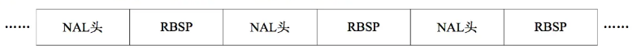
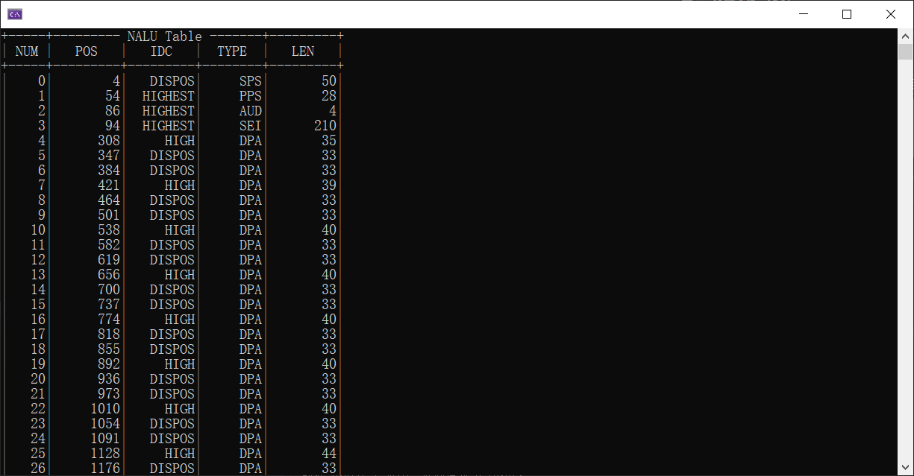

[H.264简介](#H.264简介)

[H.264格式](#H.264格式)

- [NALU](#NALU)
  - [NAL Header](#NAL Header)
  - [RBSP](#RBSP)
    - [SODB](#SODB)
    - [RBSP尾](#SODB)
  - [EBSP](#EBSP)

[H.264编码流程](#H.264编码流程)

[ffmpeg命令](#ffmpeg命令)

[解析NAL Header](#解析NAL Header)

# H.264

本文只涉及包结构，有个大概的认识，不涉及到编码算法。后续有机会再了解。

[H.264英文文档](http://www.itu.int/rec/T-REC-H.264)

[H.264中文文档05版](https://www.itu.int/rec/T-REC-H.264-200503-S/en)

## H.264简介

**H.264**，又称为**MPEG-4第10部分，高级视频编码**（英语：MPEG-4 Part 10, Advanced Video Coding，缩写为MPEG-4 AVC）是一种面向块，基于[运动补偿](https://zh.wikipedia.org/wiki/运动补偿)的[视频编码标准](https://zh.wikipedia.org/w/index.php?title=视频编码标准&action=edit&redlink=1) 。到2014年，它已经成为高精度视频录制、压缩和发布的最常用格式之一。

H.264/AVC项目的目的是为了创建一个比以前的视频压缩标准，在更低的比特率的情况下依然能够提供良好视频质量的标准（如，一半或者更少于MPEG-2,H.263,或者MPEG-4 Part2 ）。同时，还要不会太大的增加设计的复杂性。

H.264相比于更早的H.263等其他的编码格式，有以下优势：

- 网络亲和性，适用于各种传输网络
- 高视频压缩比，最初提出的指标比H.263、MPEG-4压缩率更高，约为它们的2倍

2012年提出了H.265，H.265即HEVC（High Efficiency Video Coding），目的是为了取代H.264，H.265能够达到H.264两倍的压缩率。

## H.264格式

H.264原始码流（裸流），由一个接一个NALU组成，而它的功能分为两层：视频编码层(VCL, Video Coding Layer)和网络提取层(NAL, Network Abstraction Layer)。

VCL数据即编码处理的输出，它表示被压缩编码后的视频数据序列。在 VCL 数据传输或存储之前，这些编码的VCL数据，先被映射或封装进NAL单元（NALU）中。

**每个NAL单元包括**：一组对应于视频编码数据的NAL头信息和一个原始字节序列负荷（RBSP）。

头信息中包含着一个可否丢弃的指示标记，标识着该NAL单元的丢弃能否引起错误扩散，一般如果NAL单元中的信息不用于构建参考图像，则认为可以将其丢弃；最后包含的是NAL单元的类型 信息，暗示着其内含有效载荷的内容。 **送到解码器端的NAL单元必须遵守严格的顺序，如果应用程序接收到的NAL单元处于乱序，则必须提供一种恢复其正确顺序的方法。**对于RTP/UDP/IP系统，则可以直接将编码器输出的NAL单元作为RTP的有效载荷。

### NALU

NALU以**0x00 00 01**或**0x00 00 00 01**开头，标准规定可以以0x00 00 00作为一个NALU的结束标志。
$$
NALU = NAL Header + RBSP
$$
下图中NAL头+RBSP就是一个NALU，传输时每个NALU都是独立传输的。

<center>
	
	<center>NALU结构</center>
</center>

#### NAL Header

NAL头长度为1字节，内部包括三个标志：

- forbidden_zero

  1bit，正常为0，当网络传输NALU可能存在错误时，为1，解码器可以考虑不对该NALU解码。

- nal_ref_idc

  2bit，取值从0~3，值越大，表示当前NALU越重要。

  当前NALU为图像参数集、序列参数集、IDR图像或参考图像条带（片），或者为参考图像条带数据分割时，nal_ref_idc必定不为0。

  当nal_unit_type为6、9、10、11、11、12时，nal_ref_type都为0。

- nal_unit_type

  5bit，表示NALU中RBSP的数据结构类型，类型见下表：

  | nal_unit_type |  NAL单元和RBSP语法结构的内容   |
  | :-----------: | :----------------------------: |
  |       0       |             未指定             |
  |       1       |    一个非IDR图像的编码条带     |
  |       2       |      编码条带数据分割块A       |
  |       3       |      编码条带数据分割块B       |
  |       4       |      编码条带数据分割块C       |
  |       5       |       IDR图像的编码条带        |
  |       6       |      辅助增强信息（SEI）       |
  |       7       |           序列参数集           |
  |       8       |           图像参数集           |
  |       9       |         访问单元分隔符         |
  |      10       |            序列结尾            |
  |      11       |             流结尾             |
  |      12       |            填充数据            |
  |      13       |         序列参数集扩展         |
  |     14-18     |              保留              |
  |      19       | 未分割的辅助编码图像的编码条带 |
  |     21-23     |              保留              |
  |     24-31     |             未指定             |

#### RBSP

RBSP（原始字节序列载荷，Raw Byte Sequence Payload）中包含两部分，SODB和RBSP尾部。

##### SODB

SODB（数据比特串，String Of Data Bits），这个内部存储的是真正的原始编码数据。

##### RBSP尾

RBSP尾部分为两种：

- nal_unit_type不为1~5时，则在尾部补一个比特位，值为1，然后补若干个比特位，值为0，若干个视当前SODB长度，让字节对齐。
- nal_unit_type为1~5时，默认情况为第一种补全方式，但是当entropy_coding_mode_flag值为1，即当前采用的熵编码为CABAC，而且more_rbsp_trailing_data()返回值为true，RBSP有更多数据的时候，在后面再添加一个或多个0x0000。

关于SODB转换为RBSP定义在`nal.c`中

```c++
/*!
************************************************************************
* \brief
*    Converts String Of Data Bits (SODB) to Raw Byte Sequence
*    Packet (RBSP)
* \param currStream
*        Bitstream which contains data bits.
* \return None
* \note currStream is byte-aligned at the end of this function
*
************************************************************************
*/

void SODBtoRBSP(Bitstream *currStream)
{
    currStream->byte_buf <<= 1;
    currStream->byte_buf |= 1;
    currStream->bits_to_go--;
    currStream->byte_buf <<= currStream->bits_to_go;
    currStream->streamBuffer[currStream->byte_pos++] = currStream->byte_buf;
    currStream->bits_to_go = 8;
    currStream->byte_buf = 0;
}
```

#### EBSP

EBSP（扩展字节序列载荷，Encapsulated Byte Sequence Payload）则是对RBSP的拓展，EBSP很容易理解，是为了防止竞争而存在的。

为了防止竞争，H.264规定了防止竞争机制：如果在EBSP内部出现0x00 00 00或者0x00 00 01，则在最后一个字节前加入0x03。

- 0x00 00 00 ---> 0x00 00 03 00（NALU结束标志）
- 0x00 00 01 ---> 0x00 00 03 01（NALU起始标志）
- 0x00 00 02 ---> 0x00 00 03 02（保留标志）
- 0x00 00 03 ---> 0x00 00 03 03（防止视频内本身存在的0x00 00 03被作为防竞争标志）

所以EBSP的本质就是，当RBSP内部存在竞争出现歧义时，对其加上0x03。

拿到一个EBSP，只需要将所有0x00 00 03修改成0x00 00即可获得RBSP。

```c++
/*!
************************************************************************
*  \brief
*     This function add emulation_prevention_three_byte for all occurrences
*     of the following byte sequences in the stream
*       0x000000  -> 0x00000300
*       0x000001  -> 0x00000301
*       0x000002  -> 0x00000302
*       0x000003  -> 0x00000303
*
*  \param NaluBuffer
*            pointer to target buffer
*  \param rbsp
*            pointer to source buffer
*  \param rbsp_size
*           Size of source
*  \return
*           Size target buffer after emulation prevention.
*
************************************************************************
*/

int RBSPtoEBSP(byte *NaluBuffer, unsigned char *rbsp, int rbsp_size)
{
    int j     = 0;
    int count = 0;
    int i;

    for(i = 0; i < rbsp_size; i++)
    {
        if(count == ZEROBYTES_SHORTSTARTCODE && !(rbsp[i] & 0xFC))
        {
            NaluBuffer[j] = 0x03;
            j++;
            count = 0;
        }
        NaluBuffer[j] = rbsp[i];
        if(rbsp[i] == 0x00)
            count++;
        else
            count = 0;
        j++;
    }
    return j;
}
```

## H.264编码流程

帧间和帧内预测（Estimation）、变换（Transform）和反变换、量化（Quantization）和反量化、环路滤波（Loop Filter）、熵编码（Entropy Coding）。

简单记录下大概的流程。详细编码每个步骤流程后期再去学习，目前主要是希望对音视频整体有个基础的认识~

## ffmpeg命令

**转换mp4变成h264裸流**

```shell
ffmpeg -i NewRules.mp4 -vcodec copy -f h264 NewRules.264
```

**转换mp4前10秒视频变成h264裸流**

```
ffmpeg -ss 0:0:0 -t 0:0:10 -i NewRules.mp4 -vcodec copy NewRules_cut.264
```

## 解析NAL Header

代码参照雷神的博客编写。

代码逻辑很简单，按照格式将每个NALU分割找到，然后再解析第一个字节，即NAL Header。解析结果如图：

<center>
	
	<center>NAL Header Parser Result</center>
</center>

这里展示下部分代码，详细代码访问[项目地址](https://github.com/jo-qzy/AudioVideoLearning/tree/master/src/H.264)：

```c++
bool H264Parser::GetNextNALU()
{
    int cur_pos = 0;
    bool start_code_found = false;
    bool info2 = false, info3 = false;
    bool eof_flag = false;
    char start_code[4];

    // 找NALU开头
    if (3 != fread(start_code, 1, 3, h264_stream)) {
        return false;
    }
    info2 = FindStartCode2(start_code);
    if (info2) {
        nalu->start_code_len = 3;
    } else {
        if (1 != fread(start_code + 3, 1, 1, h264_stream)) {
            return false;
        }
        info3 = FindStartCode3(start_code);
        if (info3) {
            nalu->start_code_len = 4;
        } else {
            return false;
        }
    }

    // 找下一个NALU的开头
    start_code_found = false;
    info2 = info3 = false;
    while (!start_code_found) {
        if (feof(h264_stream)) {
            eof_flag = true;
            break;
        }
        nalu->buffer[cur_pos++] = fgetc(h264_stream);
        info3 = FindStartCode3(nalu->buffer + cur_pos - 4);
        if (!info3) {
            info2 = FindStartCode2(nalu->buffer + cur_pos - 3);
        }
        start_code_found = (info2 || info3);
    }

    // 当前NALU开头到下一个NALU开头之间的数据就是我们要的
    // 然后把FILE指针恢复到下一个NALU开头开始的位置
    if (eof_flag) {
        nalu->sodb_len = cur_pos - 1;
    } else {
        int rwind = info2 ? -3 : -4;
        if (0 != fseek(h264_stream, rwind, SEEK_CUR)) {
            std::cout << "Error: fseek error\n";
            return false;
        }
        nalu->sodb_len = cur_pos + rwind;
    }
    // 分析NAL Header
    nalu->forbidden_bit = nalu->buffer[0] & 0x80;      //1 bit
    nalu->nalu_reference_idc = nalu->buffer[0] & 0x60; // 2 bit
    nalu->nalu_unit_type = (nalu->buffer[0]) & 0x1f;   // 5 bit
    return true;
}
```

