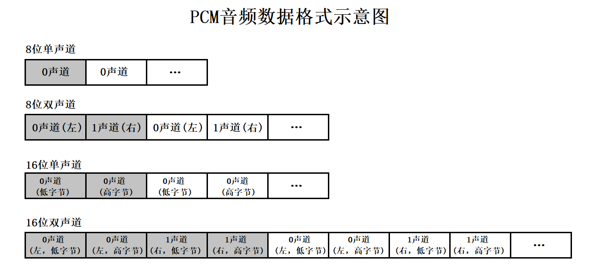
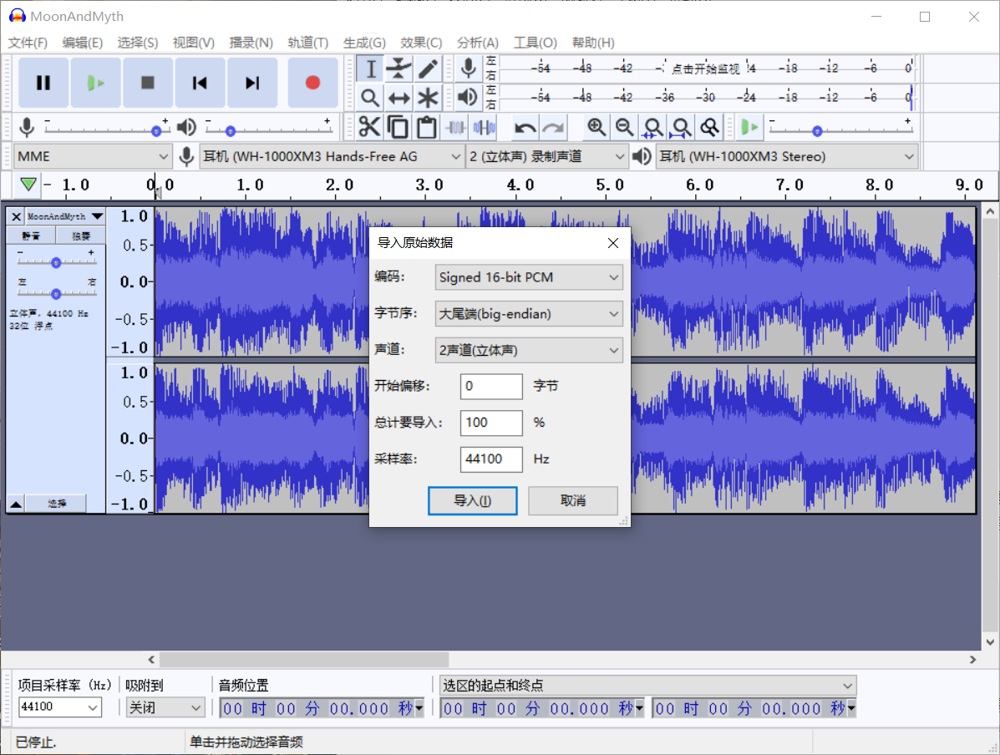
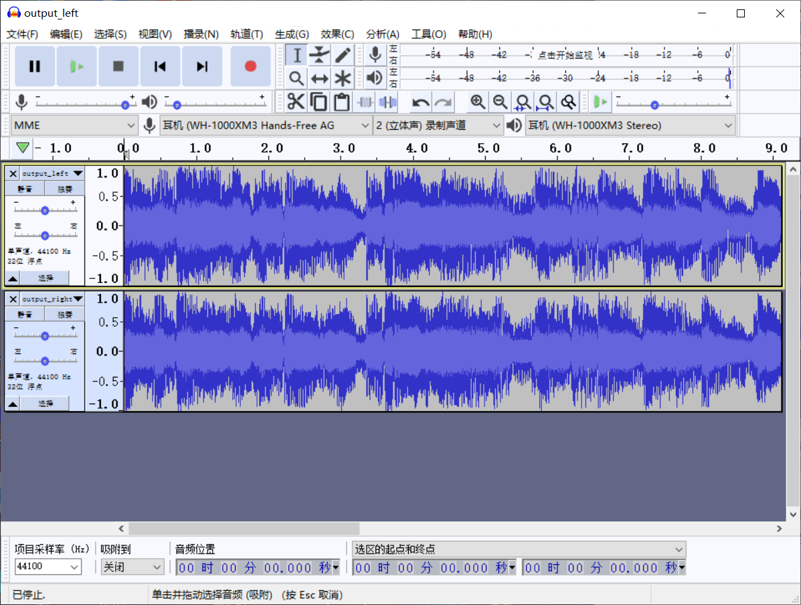
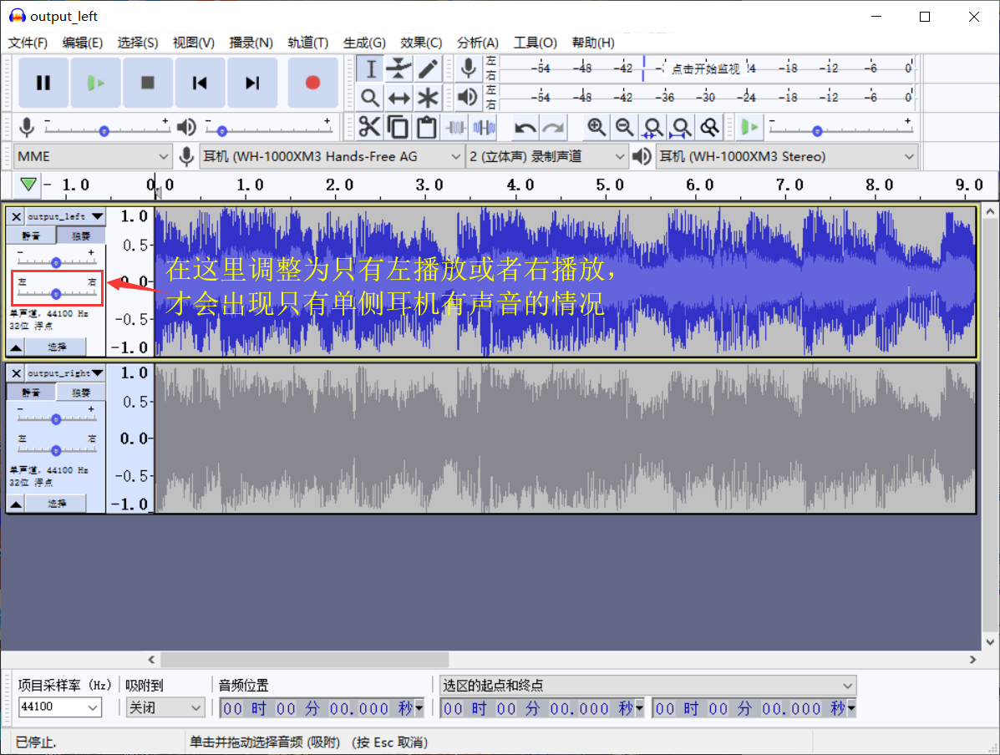
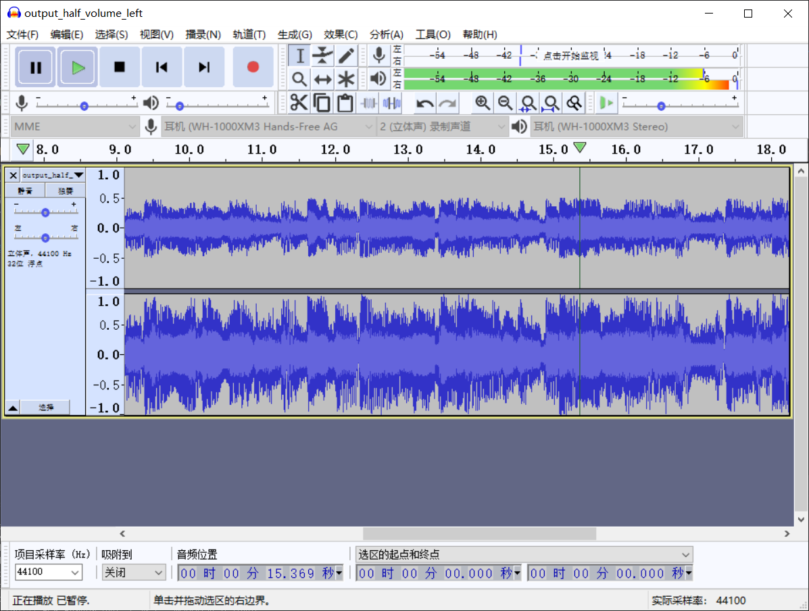
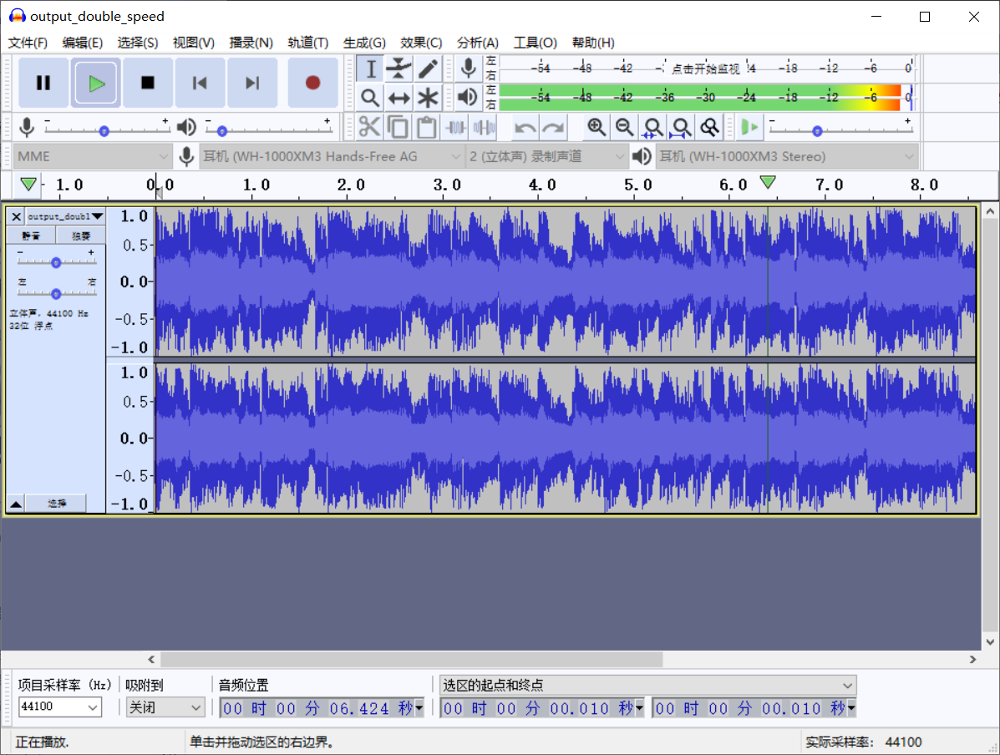
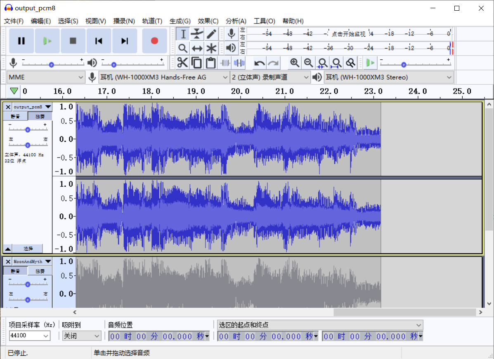
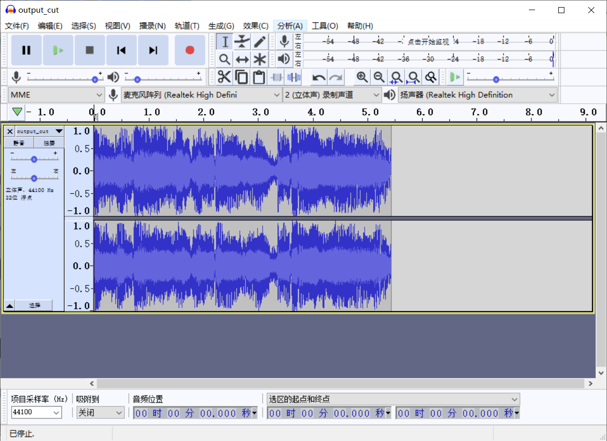
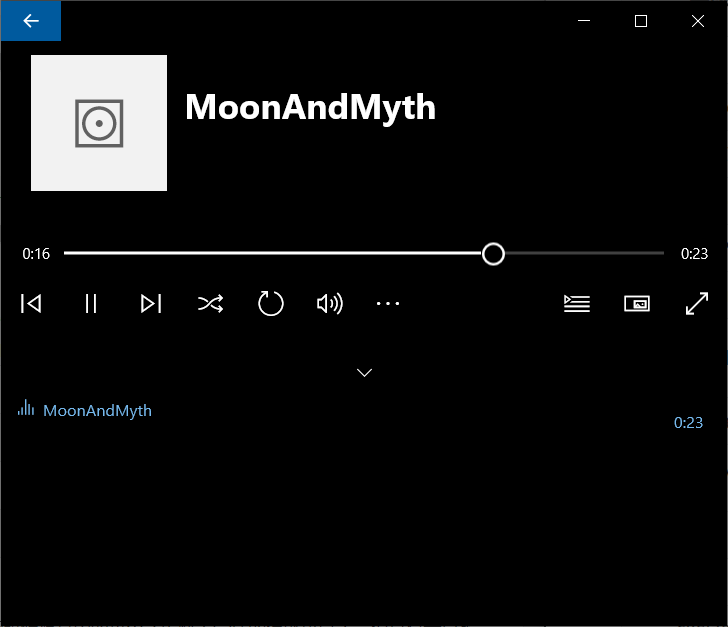

[基本概念](#基本概念)

[影响PCM质量的来源](#影响PCM质量的来源)

[无损音乐](#无损音乐)

[PCM格式](#PCM格式)

[PCM PARSER](#PCM PARSER)

- [1. 分离PCM16BE双声道音频采样数据的左声道和右声道](#1. 分离PCM16BE双声道音频采样数据的左声道和右声道)
- [2. 将PCM16BE双声道音频采样数据中左声道音量降低一半](#2. 将PCM16BE双声道音频采样数据中左声道音量降低一半)
- [3. 将PCM16BE双声道音频采样数据的声音速度提高一倍](#3. 将PCM16BE双声道音频采样数据的声音速度提高一倍)
- [4. 将PCM16BE双声道音频采样数据转换为PCM8音频采样数据](#4. 将PCM16BE双声道音频采样数据转换为PCM8音频采样数据)
- [5. 将PCM16BE音频数据截取一段](#5. 将PCM16BE音频数据截取一段)
- [6. 将PCM16BE双声道音频数据转化为WAVE格式音频数据](#6. 将PCM16BE双声道音频数据转化为WAVE格式音频数据)

# PCM

整理自[Wikipedia](https://zh.wikipedia.org/wiki/%E8%84%88%E8%A1%9D%E7%B7%A8%E7%A2%BC%E8%AA%BF%E8%AE%8A)和网上的博客，以及[雷霄骅先生的博客](https://blog.csdn.net/leixiaohua1020/article/details/50534316)

用到的资源：

- [Audacity](https://www.audacityteam.org/)

  一款开源的免费的音频处理软件，遵循GNU协议的免费软件

- [本文PCM项目地址](https://github.com/jo-qzy/AudioVideoLearning/tree/master/src/PCM)

  用到的资源均可在改地址下载

## 基本概念

**脉冲编码调制**（英语：**P**ulse-**c**ode **m**odulation，缩写：**PCM**）是一种模拟信号的数字化方法。PCM将信号的强度依照同样的间距分成数段，然后用独特的数字记号（通常是二进制）来量化)。

用通俗点的方式解释下就是，用类似把曲线图画成直方图的方法，把模拟信号变成数字信号。说白了就是把模拟信号（声音）切成一小段，一小段，然后给每一小段根据音量取一个值，记录下来，就变成可以存到计算机里面的数字信号了，计算机可以识别并且把这玩意还原播放出来。

## 音频编码

生活中的声音其实在通过传感器得到的都是模拟信号，传输用的却是数字信号，所以模拟信号数字化必须经过三个过程，即抽样、量化和编码，以实现话音数字化的脉冲编码调制（PCM，Pulse Coding Modulation）技术。

### 抽样

把模拟信号以其信号带宽2倍以上（奈奎斯特采样定理，在下面有介绍）的频率提取样值，变为时间轴上离散的抽样信号的过程。

**采样率**：每秒从连续信号提取并组成离散信号的采样个数，单位为赫兹（Hz），简单点理解就是一秒钟取多少个点，这个值就是Hz的值。平时我们对声音常用的的采样频率常为以下几个频率：

- 8000Hz：一般为电话所用的采样率，足以支持人和人之间的沟通
- 11025Hz：一般AM广播的采样频率
- 22050Hz：一般FM广播的采样频率
- 44100Hz：一般歌曲的采样频率，CD、Mp3等的采样频率
- 48000Hz和96000Hz：也是歌曲的常见的采样频率

一般来说人耳能够分辨的频率上限大概为20KHz，所以我的理解是觉得一般高质量歌曲的采样频率就是高于40KHz足矣，当然这个44100Hz的采样频率不是我定的，这只是我的看法，查阅了很多资料也没有看到详细关于为什么常用频率是44100Hz的比较官方的解释。

### 量化

抽样信号虽然是时间轴上离散的信号，但仍然是模拟信号，其样值在一定的取值范围内，可有无限多个值。显然，对无限个样值一一给出数字码组来对应是不可能的。为了实现以数字码表示样值，必须采用“四舍五入”的方法把样值分级“取整”，使一定取值范围内的样值由无限多个值变为有限个值。这一过程称为量化。

量化指的是对每个采样到的值进行标记，比如8bit的量化，就可以把信号分成256个等级进行标记，如果用的比特数越多，那么标记越准确，采样位数越高，精度越高。

### 编码

量化后的抽样信号就转化为按抽样时序排列的一串十进制数字码流，即十进制数字信号。简单高效的数据系统是二进制码系统，因此，应将十进制数字代码变换成二进制编码，根据十进制数字代码的总个数，可以确定所需二进制编码的位数，即字长(采样位数)这种把量化的抽样信号变换成给定字长的二进制码流的过程称为编码。

#### PCM的编码

PCM采用A律13折线进行编码，该算法具体参考[Wikipedia](https://en.wikipedia.org/wiki/A-law_algorithm)。

给定x则得到A律编码为以下结果：
$$
F(x) = sgn(x)\begin{cases}{A|x|\over 1 + \ln(A)} & |x| < {1 \over A} \\ \frac{1 + \ln(A|x|)}{1 + \ln(A)} & {1 \over A} \leq |x| \leq 1 \end{cases}
$$

## 影响PCM质量的来源

在任何PCM系统中，本质上有两种损害的来源：

- 在量化时，取样必须迫于选择接近哪一个整数值（即量化误差）。

  翻译一下，如果某一刻的声音取出来的值是0.7，那么他必须变成整数存，这就有了误差。

- 在样本与样本之间没有任何数据，根据采样定理，这代表任何频率大于或等于${\frac{1}{2}}f_{s}$（$f_{s}$指采样频率）的信号，会产生失真，或者完全消失，这又称为[奈奎斯特频率](https://zh.wikipedia.org/wiki/%E5%A5%88%E5%A5%8E%E6%96%AF%E7%89%B9%E9%A2%91%E7%8E%87)（Nyquist frequency）。

**奈奎斯特采样定理**：如果周期函数 x(t) 不包含高于 *B* cps（次/秒）的频率，那么，一系列小于 1/(2*B*) 秒的x(t)函数值将会受到前一个周期的x(t)函数值影响。因此 2*B* 样本/秒或更高的采样频率将能使函数不受干扰。

这玩意，学过但是。。我没有好好学习数字信号处理，我有罪。

在网上看到个通俗的解释：一个轮子，8条轮毂那种，如果在转动，每秒转45度，**那么每8秒，轮子会复位一次**。现在如果以**8秒为间隔**去拍摄轮子，那么将会**看到轮子状态没有变化**；如果以**4秒为间隔**拍摄照片，那么会看到轮子转动了，**状态（相位）变了**，尽管他的旋转方向我们还是不知道；如果以**3秒为间隔**拍摄照片，那么**状态变化（相位变化）**也能知道了，这就是**奈奎斯特定理**。

所以如果我们需要对声音进行采样，那么采样频率应该要大于模拟信号频率的两倍，不然声音可能会出现混叠，导致失真或者消失。

## 无损音乐

看到网上关于无损音乐的知识，记录在此予以作为附加知识。

无损音乐的并不是真的无损，上面说的影响PCM质量的来源，其实就说明了，量化的时候其实就是有损的，量化误差是无法避免的，那么无损音乐说的无损是什么无损呢？

我们常听的音乐经常会有各种格式，mp3、flac、Hi-res等，所以音乐平时并不是以pcm格式存在的，pcm是未经压缩的格式，而mp3等这些格式属于压缩格式，会将数据进行压缩，所以**无损指的是压缩过程是否有损**。

mp3的压缩原理是通过丢弃那些人耳不敏感的PCM数据进行压缩，mp3的音质与最初的不压缩音频相比没有明显的下降，感兴趣的可以看看[wikipedia关于MP3的介绍](https://zh.wikipedia.org/wiki/MP3)。

我们平时经常看到一些无损格式的码率会比较低，但是其实将解码出来之后，和原始音频数据码率是一样的；但是mp3这种，解压缩之后的码率，较原始音频数据其实有一些码率损失。

比如一个长度10s，采样率为44.1kHz，量化深度16bit，双声道的音频，码率和大小计算如下：

**音频的码率 = 采样率(44.1kHz) * 位深度(16bit) * 通道数(2) = 1411.2kbps**

**音频文件大小 = 时长(10s) * 码率(1411.2kbps) / 1024 / 8 = 1.723MB**

这是原始的音频大小，如果无损压缩，还原后数据也是1.723MB，有损压缩则会出现小于原文件的情况。我们平时看到QQ音乐有HQ和SQ，其实是mp3不同品质压缩之后的码率，320kbps的mp3已经可以接近无损的压缩格式，基本不损失原本音效质量。

## PCM格式

PCM格式如下图所示，可以看到双声道的数据都是先存左声道，再存右声道，每个声道的数据长度和量化位数有关，下图是表示**小端存储**的PCM数据存储示意图。

<center>
	
	<center>PCM FORMAT (Little Endian)</center>
</center>

## PCM PARSER

**注**：开始写代码前，注意一件事，在代码中采用的所有的声音，采样频率都是44100Hz，并且采样格式一律为16BE。16表示一个采样值占`16bit`，BE表示`Big Endian`，表示高字节存储在低地址中。

### 1. 分离PCM16BE双声道音频采样数据的左声道和右声道

本程序中的函数可以将PCM16BE双声道数据中左声道和右声道的数据分离成两个文件。我是用的

```c++
bool PcmParser::pcm16_split(const std::string url)
{
    FILE *input = fopen(url.c_str(), "rb+");
    FILE *output_left = fopen("output_left.pcm", "wb+");
    FILE *output_right = fopen("output_right.pcm", "wb+");

    unsigned char *voice = new unsigned char[4];

    while (!feof(input)) {
        fread(voice, 1, 4, input);
        fwrite(voice, 1, 2, output_left);
        fwrite(voice + 2, 1, 2, output_right);
    }

    fclose(input);
    fclose(output_left);
    fclose(output_right);
    delete[] voice;
    return true;
}
```

首先看下原始的音频数据，这里我选用的是我非常喜欢的金莎唱的星月神话，再次重复一下，格式是PCM16BE，采样频率为44100Hz，所以导入数据要选则Audicity菜单栏中的文件->导入->原始数据，选择文件后如下图所示进行导入：

<center>
	
	<center>Import audio to Audacity</center>
</center>

一个双声道的音频文件会被分离成两个单声道的文件，左声道和右声道的采样值是间隔存储的，每个采样值为2Byte，所以一次读取4个字节，再2Byte去写入两个文件，得到单声道数据，将两个输出文件导入，看下导出后数据载入Audicity的样子。

<center>
	
	<center>Output left and right</center>
</center>

可以看到两个文件都只有一个音轨，单独播放下左声道数据试试，发现两个耳机都有声音，这里要区分下单声道并不是只有一个耳机有声音的意思。

百度百科对于单声道的定义是：**一个声音通道**，用一个传声器拾取声音，用一个扬声器进行放音的过程，称之为单声道。单声道是指把**来自不同方位**的音频信号混合后统一由录音器材把它记录下来，再由一只音箱进行重放。

所以单声道并不是只有一边有声音，有可能两边都有声音，当两个声道组成立体声时，用好的耳机听，会明显感觉到层次感，感觉到声音好像在你面前或者某个位置一样。

所以我前面说左声道和右声道数据是不确切的，其实他们都是单声道数据，为了方便称呼，就以左右声道来命名。

Audicity在音源左侧，那里有左右声道平衡的条，如果把条拖动到一侧，才会出现只有单侧耳机有声音的情况，如下图：

<center>
	
	<center>单侧耳机播放</center>
</center>

### 2. 将PCM16BE双声道音频采样数据中左声道音量降低一半

本程序中的函数可以将PCM16BE左声道的音量降低一半。

雷神教程中采用的是LE的音频数据，我下载到的是BE的音频数据，我没有刻意去使用LE的素材，当然如果需要LE的音频数据，我另写了个BE转换LE的函数`pcm16_be_to_le`在代码文件离里（也可以LE转BE，代码是一样的）。

```c++
bool PcmParser::pcm16be_half_volume_left(const std::string url)
{
    FILE* input = fopen(url.c_str(), "rb+");
    FILE* output_half_volume_left = fopen("output_half_volume_left.pcm", "wb+");

    unsigned char* voice = new unsigned char[4];
    // My computer is little endian machine，so it need special handle
    short* tmp_data = new short;
    unsigned char* low_byte = reinterpret_cast<unsigned char*>(tmp_data);
    unsigned char* high_byte = reinterpret_cast<unsigned char*>(tmp_data) + 1;

    while (!feof(input)) {
        fread(voice, 1, 4, input);
        *high_byte = voice[0];
        *low_byte = voice[1];
        *tmp_data /= 2;
        fwrite(high_byte, 1, 1, output_half_volume_left);
        fwrite(low_byte, 1, 1, output_half_volume_left);
        fwrite(voice + 2, 1, 2, output_half_volume_left);
    }

    fclose(input);
    fclose(output_half_volume_left);
    delete[] voice;
    return true;
}
```

转换之后看下效果，可以看到左声道波形下降了一半：

<center>
	
	<center>降低左声道一半声音</center>
</center>

然后上耳机听，可以感受到，左耳的人声减轻了，会更明显的听到音乐的声音，声音的层次感变弱。

### 3. 将PCM16BE双声道音频采样数据的声音速度提高一倍

通过将双声道中的音频数据丢弃一半，达到提高速度的目的。

```c++
bool PcmParser::pcm16_double_speed(const std::string url)
{
    FILE* input = fopen(url.c_str(), "rb+");
    FILE* output_double_speed = fopen("output_double_speed.pcm", "wb+");

    int count = 0;

    unsigned char* voice = new unsigned char[4];

    while (!feof(input)) {
        fread(voice, 1, 4, input);
        if (0 == count % 2) {
            fwrite(voice, 1, 2, output_double_speed);
            fwrite(voice + 2, 1, 2, output_double_speed);
        }
        count++;
    }

    fclose(input);
    fclose(output_double_speed);
    delete[] voice;
    return true;
}
```

代码很简单，就是丢弃一半采样数据而已，我这里丢弃了偶数时刻的采样数据，所以音乐时间也少了一半，从原来的23秒多，变成11秒多，听了下，音乐节奏也加快了~

<center>
	
	<center>二倍速音频数据</center>
</center>

### 4. 将PCM16BE双声道音频采样数据转换为PCM8音频采样数据

将PCM16BE的数据转换为PCM8，PCM8的范围是0-255，只需要将PCM16BE中的每个采样数据的低位丢弃，高位增加128就是PCM8的量化值了~

需要注意的还是大端存储，高字节放在低地址~~~

```c++
bool PcmParser::pcm16be_to_pcm8(const std::string url)
{
    FILE* input = fopen(url.c_str(), "rb+");
    FILE* output_pcm8 = fopen("output_pcm8.pcm", "wb+");

    unsigned char* voice = new unsigned char[4];

    while (!feof(input)) {
        fread(voice, 1, 4, input);
        voice[0] += 128;
        voice[2] += 128;
        fwrite(voice, 1, 1, output_pcm8);
        fwrite(voice + 2, 1, 1, output_pcm8);
    }

    fclose(input);
    fclose(output_pcm8);
    delete[] voice;
    return true;
}
```

感觉听上去。没太大区别啊~

<center>
	
	<center>PCM16BE转换为PCM8</center>
</center>

### 5. 将PCM16BE音频数据截取一段

```c++
bool PcmParser::pcm16be_cut(const std::string url, size_t start, size_t end)
{
    FILE* input = fopen(url.c_str(), "rb+");
    FILE* output_cut = fopen("output_cut.pcm", "wb+");

    unsigned char* voice = new unsigned char[4];
    size_t cur_pos = 0;

    while (!feof(input) && cur_pos <= end) {
        fread(voice, 1, 4, input);
        if (cur_pos >= start) {
            fwrite(voice, 1, 4, output_cut);
        }
        cur_pos++;
    }

    fclose(input);
    fclose(output_cut);
    delete[] voice;
    return true;
}
```

原音乐是星月神话的副歌部分，截取到240000刚好是“千年之后你会在哪里~”。

<center>
	
	<center>裁剪</center>
</center>

### 6. 将PCM16BE双声道音频数据转化为WAVE格式音频数据

WAVE格式是Windows系统各种的一种音频格式，实质就是在PCM数据前面加了个文件头，来描述音频文件的一些基本信息，如采样率，比特率，长度等。

```c++
bool PcmParser::pcm16be_to_wave(const std::string url, int channels, int sample_rate)
{
    size_t dot_pos = url.rfind('.');
    std::string output_url(url.begin(), url.begin() + dot_pos);
    output_url += ".wav";
    FILE* input = fopen(url.c_str(), "rb+");
    FILE* output_wave = fopen(output_url.c_str(), "wb+");

    unsigned char* voice = new unsigned char[44];
    unsigned int pcm_data_size = 0;

    // Simplest WAV file = WAV header + PCM data
    Wave::WAVE_HEADER wave_header;
    Wave::WAVE_FMT wave_fmt;
    Wave::WAVE_DATA wave_data;
    long header_size = sizeof(wave_header) + sizeof(wave_fmt) + sizeof(wave_data);

    // Write PCM data first
    fseek(output_wave, header_size, SEEK_CUR);
    while (!feof(input)) {
        fread(voice, 1, 2, input);
        // Save data in Little Endian
        fwrite(voice + 1, 1, 1, output_wave);
        fwrite(voice, 1, 1, output_wave);
        pcm_data_size += 2;
    }

    // Orgnize WAV header
    memcpy(wave_header.ChunkID, "RIFF", strlen("RIFF"));
    wave_header.ChunkSize = header_size + pcm_data_size;
    memcpy(wave_header.FccType, "WAVE", strlen("WAVE"));

    memcpy(wave_fmt.ChunkID, "fmt ", strlen("fmt "));
    wave_fmt.ChunkID[4] = ' ';
    wave_fmt.ChunkSize = sizeof(Wave::WAVE_FMT) - 8;
    wave_fmt.FormatTag = 1;
    if (channels == 0 || sample_rate == 0) {
        wave_fmt.Channels = 2;
        wave_fmt.SamplePerSec = 44100;
    } else {
        wave_fmt.Channels = channels;
        wave_fmt.SamplePerSec = sample_rate;
    }
    wave_fmt.BytesPerSec = wave_fmt.SamplePerSec * 16;
    wave_fmt.BlockAlign = 4;
    wave_fmt.BitsPerSample = 16;

    memcpy(wave_data.ChunkID, "data", strlen("data"));
    wave_data.ChunkSize = pcm_data_size;

    rewind(output_wave);
    fwrite(&wave_header, sizeof(Wave::WAVE_HEADER), 1, output_wave);
    fwrite(&wave_fmt, sizeof(Wave::WAVE_FMT), 1, output_wave);
    fwrite(&wave_data, sizeof(Wave::WAVE_DATA), 1, output_wave);

    fclose(input);
    fclose(output_wave);
    delete[] voice;
    return true;
}
```

WAVE格式头由以下三部分组成：

- WAVE_HEADER

  |   字段   |  类型  | 字节数 |              描述               |
  | :------: | :----: | :----: | :-----------------------------: |
  |   ckid   |  char  |   4    |        "RIFF" 标志, 大写        |
  |  cksize  | uint32 |   4    | 文件长度。三个部分长度+数据长度 |
  | fcc type |  char  |   4    |     "WAVE" 类型块标识, 大写     |

- WAVE_FMT

  |     字段      |  类型  | 字节数 |                          描述                           |
  | :-----------: | :----: | :----: | :-----------------------------------------------------: |
  |     ckid      |  char  |   4    |          "fmt "，注意最后一个字符为空格，小写           |
  |    cksize     | uint32 |   4    |            当前块的长度，不包括ckid和cksize             |
  |   FormatTag   | int16  |   2    |               音频数据的编码方式，1为PCM                |
  |   Channels    | int16  |   2    |              声道数，单声道为1，双声道为2               |
  | SamplesPerSec | int32  |   4    |         采样率，本文中用到的音频数据一律为44100         |
  |  BytesPerSec  | int32  |   4    |               比特率，采样率*每次采样大小               |
  |  BlockAlign   | int16  |   2    | 每次采样大小，采样精度 * 声道数 / 8，16bit采样率该值为4 |
  | BitsPerSample | int16  |   2    |             每个声道的采样精度，16bit就是16             |

- WAVE_DATA

  |  字段  |  类型  | 字节数 |      描述      |
  | :----: | :----: | :----: | :------------: |
  |  ckid  |  char  |   4    |  "data"，小写  |
  | cksize | uint32 |   4    | 音频数据的长度 |

尝试用Windows10自带的Grove音乐打开，能够正常播放

<center>
	
	<center>使用Grove播放生成的wav文件</center>
</center>