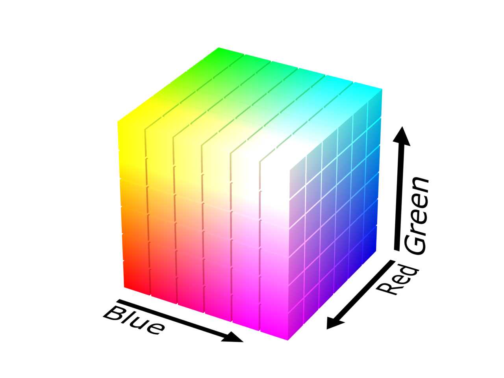
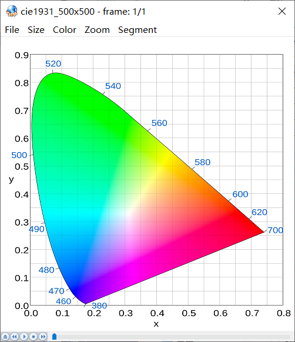
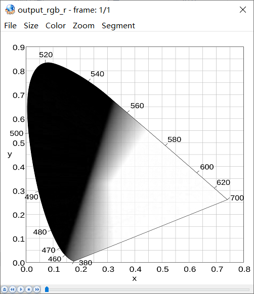
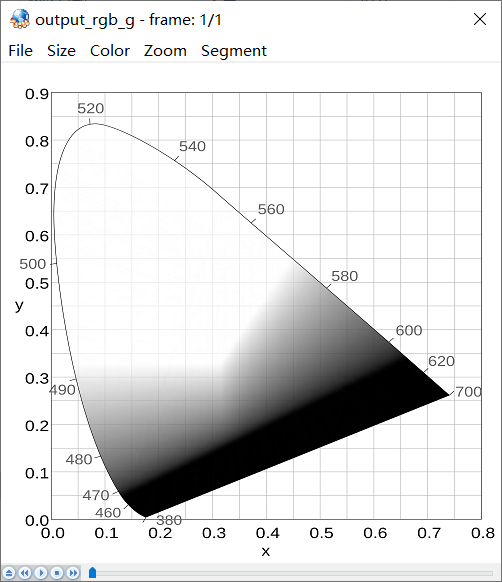
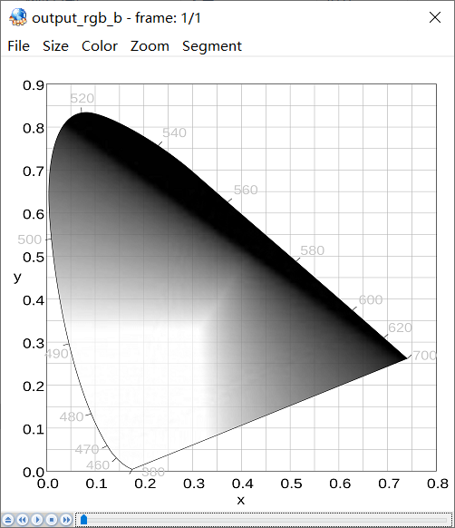
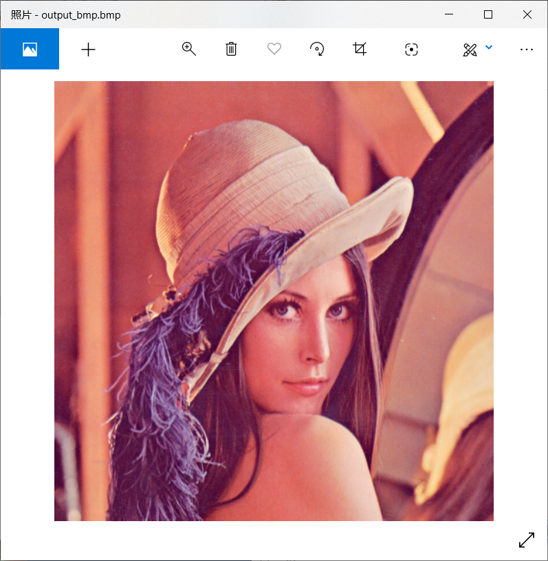
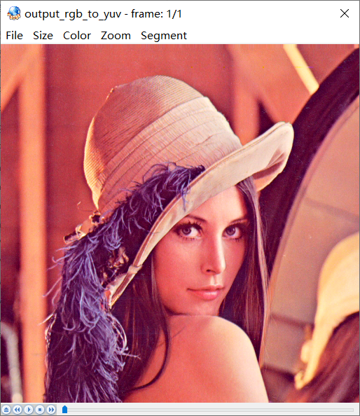
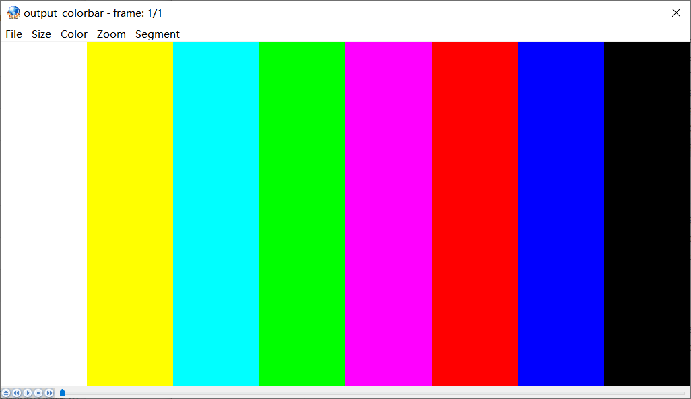

# RGB

概念别问，问就是抄的Wikipedia，代码来自[雷霄骅先生的博客](https://blog.csdn.net/leixiaohua1020/article/details/50534150)。

## 基本概念

**三原色光模式**（**RGB color model**），又称**RGB颜色模型**或**红绿蓝颜色模型**，是一种加色模型，将红（**R**ed）、绿（**G**reen）、蓝（**B**lue）三原色的色光以不同的比例相加，以合成产生各种色彩光。

一个颜色显示的描述是由三个数值控制的，他分别为[R](https://zh.wikipedia.org/wiki/R)、[G](https://zh.wikipedia.org/wiki/G)、[B](https://zh.wikipedia.org/wiki/B)。当三个数值位为最大时，显示为白色，当三个数值最小时，显示为黑色。

RGB可以和YUV互相转换：

$$
R = Y + 1.13983 * (V - 128)
$$

$$
G = Y - 0.39465 * (U - 128) - 0.58060 * (V - 128)
$$

$$
B = Y + 2.03211 * (U - 128)
$$

<center>
	
	<center>RGB</center>
</center>

## RGB几种常见的表示形式

### 16比特模式

16比特模式分配给每种原色各为5比特，其中绿色为6比特，因为人眼对绿色分辨的色调更精确。但某些情况下每种原色各占5比特，余下的1比特不使用。

### 24比特模式

每像素24位（比特s per pixel，bpp）编码的RGB值：使用三个8位无符号整数（0到255）表示红色、绿色和蓝色的强度。这是当前主流的标准表示方法，用于[真彩色](https://zh.wikipedia.org/wiki/%E7%9C%9F%E5%BD%A9%E8%89%B2)和[JPEG](https://zh.wikipedia.org/wiki/JPEG)或者[TIFF](https://zh.wikipedia.org/wiki/TIFF)等图像文件格式里的通用颜色交换。它可以产生一千六百万种颜色组合，对人类的眼睛来说，其中有许多颜色已经是无法确切的分辨。

说白了就是先存R(8bit)，再存G(8bit)，再存B(8bit)，一共24bit，每个颜色256个梯度，交错地以`RGBRGBRGB...`这样的形式存在文件里面。

### 32比特模式

实际就是**24比特模式**，余下的8比特不分配到像素中，这种模式是为了提高数据输送的速度（32比特为一个[DWORD](https://zh.wikipedia.org/wiki/%E5%AD%97)，DWORD全称为Double Word，一般而言一个Word为16比特或2个字节，处理器可直接对其运算而不需额外的转换）。同样在一些特殊情况下，如[DirectX](https://zh.wikipedia.org/wiki/DirectX)、[OpenGL](https://zh.wikipedia.org/wiki/OpenGL)等环境，余下的8比特用来表示象素的透明度（Alpha）。

## RGB_PARSER

### 1. 分离RGB24像素数据中的R、G、B分量

```c++
bool RgbParser::rgb24_split(const std::string input_url, int width, int height, int frame_num)
{
    FILE *input_file = fopen(input_url.c_str(), "rb+");
    FILE *output_r = fopen("output_rgb_r.y", "wb+");
    FILE *output_g = fopen("output_rgb_g.y", "wb+");
    FILE *output_b = fopen("output_rgb_b.y", "wb+");

    unsigned char *picture = new unsigned char[width * height * 3];

    for (int i = 0; i < frame_num; i++) {
        fread(picture, 1, width * height * 3, input_file);
        for (int cur_pixel = 0; cur_pixel < width * height * 3; cur_pixel += 3) {
            // Read R
            fwrite(picture + cur_pixel, 1, 1, output_r);
            // Read G
            fwrite(picture + cur_pixel + 1, 1, 1, output_g);
            // Read B
            fwrite(picture + cur_pixel + 2, 1, 1, output_b);
        }
    }

    delete[] picture;
    fclose(input_file);
    fclose(output_r);
    fclose(output_g);
    fclose(output_b);
    return true;
}
```

分离后查看图片用yuvplayer查看，选择500*500，Y分量查看。

RGB24的每个像素三个分量都是连续存储的，先存储第一个像素的R、G、B，再存第二个R、G、B，所以宽（width）和高（height）的RGB图片大小为$width * height * 3 Byte$，这种存储方式成为Packed方式。

R、G、B三张图分辨率如下（此处有疑问。。没搞懂）

- output_rgb_r.y：R数据，分辨率256 *256
- output_rgb_g.y：G数据，分辨率256 *256
- output_rgb_b.y：B数据，分辨率256 *256

原图为雷神提供的CIE 1931标准图：

<center>
	
	<center>cie1931_500x500.rgb</center>
</center>


效果图如下：

<center>
	
	<center>output_rgb_r.y</center>
</center>

<center>
	
	<center>output_rgb_g.y</center>
</center>

<center>
	
	<center>output_rgb_b.y</center>
</center>


### 2. 将RGB格式像素数据封装为BMP图像

将RGB转换为BMP图像，就可以使用Windows自带的图片查看器查看，对于BMP来说，如果是未压缩的格式，那么除了头部信息外，剩下的数据和RGB类似，只不过是以B、G、R的顺序存储，所以只需要加上头并且略加修改即可。

首先了解下BMP的格式:

#### BMP_FILE_HEADER

BMP文件有文件头，在Windows中定义如下：

```c++
typedef struct tagBITMAPFILEHEADER
{
    UINT16 bfType;
    DWORD  bfSize;
    UINT16 bfReserved1;
    UINT16 bfReserved2;
    DWORD  bfOffBits;
} BITMAPFILEHEADER;
```

|    变量名    | 地址偏移 |  大小  |                    作用                    |
| :----------: | :------: | :----: | :----------------------------------------: |
|    bfType    | 0x0000H  | 2 Byte | 一般为'BM'，在小端的机器时要注意字节序问题 |
|    bfSize    | 0x0002H  | 4 Byte |         位图文件的大小，字节为单位         |
| bfReserverd1 | 0x0006H  | 2 Byte |             保留，必须设置为0              |
| bfReserverd2 | 0x0008H  | 2 Byte |             保留，必须设置为0              |
| bfbfOffBits  | 0x000AH  | 4 Byte |   说明从文件头开始到实际数据之间的偏移量   |

#### BMP_INFO_HEADER

```c++
typedef struct tagBITMAPINFOHEADER
{
    DWORD biSize;
    LONG  biWidth;
    LONG  biHeight;
    WORD  biPlanes;
    WORD  biBitCount;
    DWORD biCompression;
    DWORD biSizeImage;
    LONG  biXPelsPerMeter;
    LONG  biYPelsPerMeter;
    DWORD biClrUsed;
    DWORD biClrImportant;
} BITMAPINFOHEADER;
```

|     变量名      | 地址偏移 |  大小  |                             作用                             |
| :-------------: | :------: | :----: | :----------------------------------------------------------: |
|     biSize      | 0x000EH  | 4 Byte |                BITMAPINFOHEADER结构需要的字数                |
|     biWidth     | 0x0012H  | 4 Byte |                 说明图像的宽度，以像素为单位                 |
|    biHeight     | 0x0016H  | 4 Byte | 说明图像的高度，以像素为单位。<br />若为正值，则图像为倒向；<br />若为负值，则图像为正向 |
|    biPlanes     | 0x001AH  | 2 Byte |              为目标设备说明颜色平面数，一般为1               |
|   biBitCount    | 0x001CH  | 2 Byte |          一像素需要的比特数，可以为1、4、8、16、24           |
|  biCompression  | 0x001EH  | 4 Byte |           说明图像数据压缩类型，最常用为0，不压缩            |
|   biSizeImage   | 0x0022H  | 4 Byte |                       说明图像字节大小                       |
| biXPelsPerMeter | 0x0026H  | 4 Byte |                 说明水平分辨率，可以设置为0                  |
| biYPelsPerMeter | 0x002AH  | 4 Byte |                 说明垂直分辨率，可以设置为0                  |
|    biClrUsed    | 0x002EH  | 4 Byte |         说明位图使用的颜色索引数，为0表示所有调色板          |
| biClrImportant  | 0x0032H  | 4 Byte |         对图像显示有影响的颜色索引数目，0表示都重要          |

#### color palette

代码中没有用到调色板，不过可以有。

调色板其实是一张映射表，标识颜色索引号与其代表的颜色的对应关系。它在文件中的布局就像一个二维数组`palette[N][4]`，其中N表示总的颜色索引数，每行的四个元素分别表示该索引对应的B、G、R和Alpha的值，每个分量占一个字节。如不设透明通道时，Alpha为0。

#### 代码

代码中有一个地方需要注意，那就是`BITMAP_FILE_HEADER::bfType`这个值，由于我的机器是小端的（应该所有Windows都是小端的吧），在赋值的时候我一开始写的是`('B') << 8) + 'M'`，结果出问题了，windows图片查看器识别不出来文件格式，其实是图片查看器读到了**MB**导致的，所以正确的写法应该是`('M') << 8) + 'B'`，这样在小端机器上是能跑成的。

```c++
bool RgbParser::rgb24_to_bmp(const std::string input_url, int width, int height)
{
    FILE *input_file = fopen(input_url.c_str(), "rb+");
    FILE *output_bmp = fopen("output_bmp.bmp", "wb+");

    unsigned char *picture = new unsigned char[width * height * 3];

    BMP::BIT_MAP_FILE_HEADER bmp_file_header;
    BMP::BIT_MAP_INFO_HEADER bmp_info_header;

    // Fill bit map file header
    // Note: the bfType is only useful in little endian machine.
    bmp_file_header.bfType = ((unsigned short int)('M') << 8) + 'B';
    bmp_file_header.bfSize = sizeof(bmp_file_header) + sizeof(bmp_info_header) + width * height * 3 ;
    bmp_file_header.bfReserverd1 = 0;
    bmp_file_header.bfReserverd2 = 0;
    bmp_file_header.bfbfOffBits = sizeof(bmp_file_header) + sizeof(bmp_info_header);

    // Fill bit map info header
    bmp_info_header.biSize = sizeof(bmp_info_header);
    bmp_info_header.biWidth = width;
    bmp_info_header.biHeight = -height;
    bmp_info_header.biPlanes = 1;        // Must be 1
    bmp_info_header.biBitcount = 24;     // RGB24 need 24 bit to description one pixel
    bmp_info_header.biCompression = 0;   // 0 means without compression
    bmp_info_header.biSizeImage = width * height * 3; // RGB24 can set it to 0
    bmp_info_header.biXPelsPermeter = 0; // Most time it set to 0
    bmp_info_header.biYPelsPermeter = 0; // Most time it set to 0
    bmp_info_header.biClrUsed = 0;       // 0 means use all palette
    bmp_info_header.biClrImportant = 0;  // 0 means all color is important

    unsigned char temp_val = 0;

    fread(picture, 1, width * height * 3, input_file);
    for (int cur_pixel = 0; cur_pixel < width * height * 3; cur_pixel += 3) {
        temp_val = picture[cur_pixel];
        picture[cur_pixel] = picture[cur_pixel + 2];
        picture[cur_pixel + 2] = temp_val;
    }

    fwrite(&bmp_file_header, 1, sizeof(bmp_file_header), output_bmp);
    fwrite(&bmp_info_header, 1, sizeof(bmp_info_header), output_bmp);
    fwrite(picture, 1, width * height * 3, output_bmp);

    delete[] picture;
    fclose(input_file);
    fclose(output_bmp);
    return true;
}
```

使用lena512的rgb24图片生成bmp效果如下：

<center>
	
	<center>output_bmp.bmp</center>
</center>

### 10. 将RGB24格式像素数据转换为YUV420P格式像素数据

调用下公式就行，回顾下公式：
$$
Y = 0.299 * R + 0.587 * G + 0.114 * B
$$

$$
U = -0.169 * R - 0.331 * G + 0.5 * B + 128
$$

$$
V =  0.5 * R - 0.419 * G - 0.081 * B + 128
$$

U取第1行第一个点，V取第一行第三个点，然后U再取第一行第5个点，然后V取第一行第七个点，以此类推，写出如下代码，雷神用的是整数去算的方式，其实也差不多，结果是一样的。

```c++
bool RgbParser::rgb24_to_yuv420p(const std::string input_url, int width, int height)
{
    FILE *input_file = fopen(input_url.c_str(), "rb+");
    FILE *output_yuv = fopen("output_rgb_to_yuv.yuv", "wb+");

    unsigned char *rgb_picture = new unsigned char[width * height * 3];
    unsigned char *yuv_picture = new unsigned char[width * height * 3 / 2];

    int cur_y = 0, cur_u = width * height, cur_v = width * height * 5 / 4;
    int cur_width = 0, cur_height = 0;
    unsigned char r = 0, g = 0, b = 0;

    fread(rgb_picture, 1, width * height * 3, input_file);
    for (int cur_pixel = 0; cur_pixel < width * height * 3; cur_pixel += 3) {
        r = rgb_picture[cur_pixel];
        g = rgb_picture[cur_pixel + 1];
        b = rgb_picture[cur_pixel + 2];
        yuv_picture[cur_y++] = (unsigned char)(0.299 * (double)r + 0.587 * (double)g + 0.114 * (double)b);

        cur_width = (cur_pixel / 3) % width;
        cur_height = (cur_pixel / 3) / width;
        // Every four
        if (cur_width % 2 == 0 && cur_height % 2 == 0) {
            yuv_picture[cur_u++] = (unsigned char)(-0.169 * (double)r - 0.331 * (double)g + 0.5 * (double)b + 128);
        }
        else {
            if (cur_width % 2 == 0) {
                yuv_picture[cur_v++] = (unsigned char)(0.5 * (double)r - 0.419 * (double)g - 0.081 * (double)b + 128);
            }
        }
    }

    fwrite(yuv_picture, 1, width * height * 3 / 2, output_yuv);

    delete[] rgb_picture;
    delete[] yuv_picture;
    fclose(input_file);
    fclose(output_yuv);
    return true;
}
```

结果如下：

<center>
	
	<center>output_yuv.yuv</center>
</center>

### 4. 生成RGB24格式的彩条测试图

彩条顺序”白黄青绿品红蓝黑“，RGB值如下：

| 颜色 |  R   |  G   |  B   |
| :--: | :--: | :--: | :--: |
|  白  | 255  | 255  | 255  |
|  黄  | 255  | 255  |  0   |
|  青  |  0   | 255  | 255  |
|  绿  |  0   | 255  |  0   |
|  品  | 255  |  0   | 255  |
|  红  | 255  |  0   |  0   |
|  蓝  |  0   |  0   | 255  |
|  黑  |  0   |  0   |  0   |

```c++
bool RgbParser::rgb24_colorbar(int width, int height)
{
    FILE *output_rgb = fopen("output_colorbar.rgb", "wb+");
    unsigned char *picture = new unsigned char[width * height * 3];

    int width_range = width / 8;
    int cur_width_max = width_range;

    char color[8][3] = {
        { 255, 255, 255 }, { 255, 255, 0 }, { 0, 255, 255 },
        { 0, 255, 0 }, { 255, 0, 255 }, { 255, 0, 0 },
        { 0, 0, 255 }, { 0, 0, 0 }
    };

    for (int cur_width = 0; cur_width < width; cur_width++) {
        // NOTE: All the extra pixels in the end are in black.
        int cur_color_pos = cur_width / width_range == 8 ? 7 : cur_width / width_range;
        for (int cur_height = 0; cur_height < height; cur_height++) {
            int cur_pixel = width * cur_height * 3 + cur_width * 3;
            picture[cur_pixel] = color[cur_color_pos][0];
            picture[cur_pixel + 1] = color[cur_color_pos][1];
            picture[cur_pixel + 2] = color[cur_color_pos][2];
        }
    }

    fwrite(picture, 1, width * height * 3, output_rgb);

    delete[] picture;
    fclose(output_rgb);
    return true;
}
```

生成效果图如下：

<center>
	
	<center>output_colobar.rgb</center>
</center>

