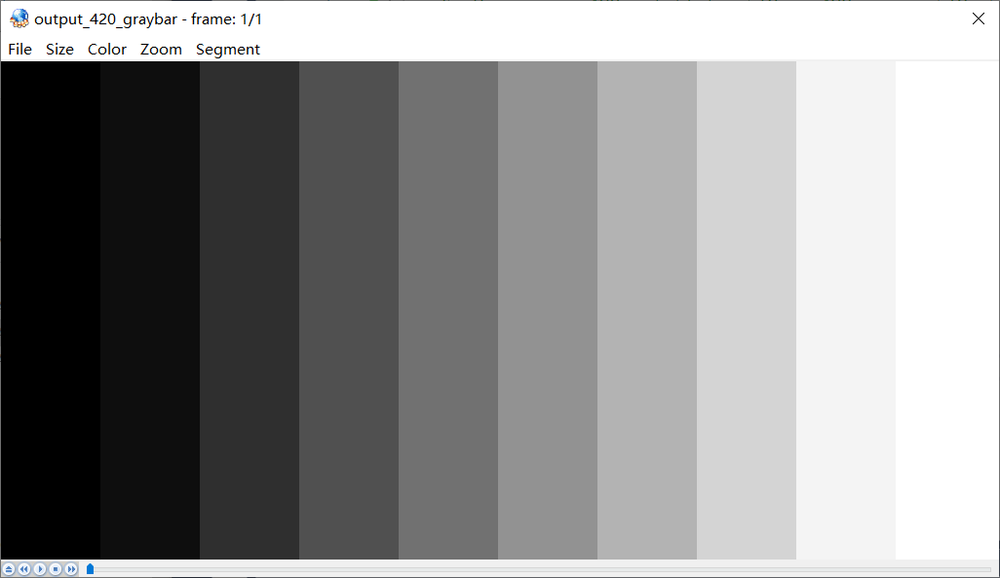

# YUV

## 基本概念

YUV最初提出是为了解决彩色电视和黑白电视的兼容问题，YUV分别为亮度信息（Y）与色彩信息（UV）。YUV比RGB的优势在于不要求三个独立视频信号同时传输，所以占用带宽（频宽）更少。历史原因，YUV和Y'UV通常用来编码电视的模拟信号，而YCbCr则是用来描述数字的影像信号，适合影片与图片压缩以及传输，有时候看到有用Cb和Cr的方式来表示，其实等同于U和V，但应该严格区分YUV和YCbCr这两个专有名词有时并非完全相同，今天大家所讲的YUV其实就是指YCbCr。

YUV种类很多，可以理解为**二维的**，即“空间-间”，和“空间-内”这样的表述，借鉴了h264中的帧间和帧内的思想。

- 空间-间：不同空间，即描述一个像素的bit数不同，如YUV444,、YUV422、YUV411、YUV420
- 空间-内：相同空间，即描述一个像素的bit数相同，但存储方式不同，比如对于YUV420而言，又可以细分为YUV420P、YUV420SP、NV21、NV12、YV12、YU12，I420

**在理解YUV格式时，时刻记住从bit数、存储结构两方面考察。**

YUV Formats格式分为两类：

1. 平面格式（planar formats）：先连续存储所有像素点的Y，紧接着存储所有像素点的U，随后是所有像素点的V
2. 紧缩格式（packed formats）：每个像素点的Y、U、V是连续交叉存储的

YUV，分为三个分量，“Y”表示明亮度（Luminance或Luma），也就是灰度值；而“U”和“V” 表示的则是色度（Chrominance或Chroma），作用是描述影像色彩及饱和度，用于指定像素的颜色。

YUV码流的存储格式其实与其采样的方式密切相关，主流的采样方式有四种：

- YUV444：4:4:4表示完全取样。
- YUV422：4:2:2表示2:1的水平取样，垂直完全采样。
- YUV420：4:2:0表示2:1的水平取样，垂直2：1采样。
- YUV411：4:1:1表示4:1的水平取样，垂直完全采样。

## YUV和RGB互相转换

U和V组件可以被表示成原始的R，G，和B（R，G，B为γ预校正后的）

- YUV转换为RGB

$$
Y = 0.299 * R + 0.587 * G + 0.114 * B
$$

$$
U = -0.169 * R - 0.331 * G + 0.5 * B + 128
$$

$$
V =  0.5 * R - 0.419 * G - 0.081 * B + 128
$$

- RGB转换为YUV

$$
R = Y + 1.13983 * (V - 128)
$$

$$
G = Y - 0.39465 * (U - 128) - 0.58060 * (V - 128)
$$

$$
B = Y + 2.03211 * (U - 128)
$$

## YUV数据的存储方式

1. YUYV（属于YUV422）

   相邻的两个Y共用其相邻的两个Cb、Cr，例如对于Y'00和Y'01而言，其Cb、Cr的均值为Cb00、Cr00，其他像素点以此类推。

   .png)

2. UYVY（属于YUV422）

   相邻的两个Y共用其相邻的两个Cb、Cr，只不过和上面的YUYV不同的是Cb和Cr的顺序不同，其他像素点以此类推。

   .png)

3. YUV422P

   YUV422P的P表示Planar formats（平面格式），也就是说YUV不是交错存储而是先存Y，再存U和V，对于Y'00和Y'01而言，其Cb、Cr的均值为Cb00、Cr00。

   a

4. YV12（属于YUV420）

   YV12属于YUV420，也是Planar formats（平面格式），存储方式是先存储Y，再存储V，再存储U，4个Y分量共用一组UV，所以下图中Y'00、Y'01、Y'10、Y'11共用Cr00、Cb00。

   许多重要的编码器都采用YV12空间存储视频：MPEG-4（[x264](https://zh.wikipedia.org/wiki/X264)，[XviD](https://zh.wikipedia.org/wiki/XviD)，[DivX](https://zh.wikipedia.org/wiki/DivX)），DVD-Video存储格式MPEG-2，MPEG-1以及MJPEG。

   YU12则和YV12除存储方式略有不同外，其他类似，存储方式是先存储Y，再存储U，再存储V。

   .png)

5. NV12（YUV420）

   NV12属于YUV420格式，只不过存储方式为先存储Y，再交叉存储U和V，其提取方式与YV12类似，即Y'00、Y'01、Y'10、Y'11共用Cb00、Cr00。

   NV21和NV12略有不同，先存储Y，再交叉存储V和U。

   .png)

## yuvplayer查看YUV图像

一开始打开yuv图像全是花花绿绿的，还以为是文件坏了，直到看到一句**ffplay需要指定yuv图像大小，因为yuv文件不包含宽高数据所以必须用-video_size指定宽和高**，这才反应过来yuvplayer需要设置宽高才能正常显示。

- Size->Custom->修改宽高
- Color->选择对应的YUV格式

## ffmpeg转换及查看YUV图像

通过ffmpeg利用原始测试图片，来得到YUV420P的图像：

```shell
./ffmpeg -i ./originnal_pic/lena512color.tiff -pix_fmt yuv420p ./YUV/lena512_yuv420p.yuv
```

通过ffplay显示YUV图像：

```shell
./ffplay.exe -video_size 512*512 ./YUV/lena512_yuv420p.yuv
```

## YUV Parser

简单的解析YUV图像代码，代码均来自于[雷霄骅先生的博客](https://blog.csdn.net/leixiaohua1020/article/details/50534150)。

运行环境：Windows10、VS2017

### 1. 分离YUV420P像素数据中的Y、U、V分量

分离YUV420P的Y、U、V保存为3个文件。

```c++
bool YuvParser::yuv420_split(const std::string input_url, int width, int height, int frame_num)
{
    FILE *input_file = fopen(input_url.c_str(), "rb+");
    FILE *output_y = fopen("output_420_y.y", "wb+");
    FILE *output_u = fopen("output_420_u.y", "wb+");
    FILE *output_v = fopen("output_420_v.y", "wb+");

    unsigned char *picture = new unsigned char[width * height * 3 / 2];

    for (int i = 0; i < frame_num; i++) {
        fread(picture, 1, width * height * 3 / 2, input_file);
        
        fwrite(picture, 1, width * height, output_y);
        fwrite(picture + width * height, 1, width * height / 4, output_u);
        fwrite(picture + width * height * 5 / 4, 1, width * height / 4, output_v);
    }

    delete[] picture;
    fclose(input_file);
    fclose(output_y);
    fclose(output_u);
    fclose(output_v);
    return true;
}
```

解析出来的图像需要用`yuvplayer`查看，原始图片为512*512，如下图：


解析后图片分为3个分量，Y、U、V，使用yuvplayer，在Color选项卡中选中分量Y，首先查看Y分量，尺寸为512*512。


U、V如下图，尺寸为256*256。


### 2. 分离YUV444P像素数据中的Y、U、V分量

分离YUV444P的Y、U、V保存为3个文件。

```c++
bool YuvParser::yuv444_split(const std::string input_url, int width, int height, int frame_num)
{
    FILE *input_file = fopen(input_url.c_str(), "rb+");
    FILE *output_y = fopen("output_444_y.y", "wb+");
    FILE *output_u = fopen("output_444_u.y", "wb+");
    FILE *output_v = fopen("output_444_v.y", "wb+");

    unsigned char *picture = new unsigned char[width * height * 3];

    for (int i = 0; i < frame_num; i++) {
        fread(picture, 1, width * height * 3, input_file);
        
        fwrite(picture, 1, width * height, output_y);
        fwrite(picture + width * height, 1, width * height, output_u);
        fwrite(picture + width * height * 2, 1, width * height, output_v);
    }

    delete[] picture;
    fclose(input_file);
    fclose(output_y);
    fclose(output_u);
    fclose(output_v);
    return true;
}
```

原图依旧是lena标准图，用ffmpeg转换为YUV444P，分离后效果如下

output444_y.y


output444_u.y


output444_v.y


### 3. 将YUV420P像素数据去掉颜色（灰度图）

将YUV420P格式像素数据的彩色去掉，变成纯粹的灰度图。

```c++
bool YuvParser::yuv420_gray(const std::string input_url, int width, int height, int frame_num)
{
    FILE *input_file = fopen(input_url.c_str(), "rb+");
    FILE *output_gray = fopen("output_420_gray.yuv", "wb+");

    unsigned char *picture = new unsigned char[width * height * 3 / 2];

    for (int i = 0; i < frame_num; i++) {
        fread(picture, 1, width * height * 3 / 2, input_file);
        memset(picture + width * height, 128, width * height / 2);
        fwrite(picture, 1, width * height * 3 / 2, output_gray);
    }

    delete[] picture;
    fclose(input_file);
    fclose(output_gray);
    return true;
}
```

处理结果如下：


### 4. 将YUV420P像素数据的亮度减半

在YUV中Y代表亮度，所以只需要将Y减半，图像便会出现亮度减半。

```c++
bool YuvParser::yuv420_half_bright(const std::string input_url, int width, int height, int frame_num)
{
    FILE *input_file = fopen(input_url.c_str(), "rb+");
    FILE *output_half_bright = fopen("output_420_half_bright.yuv", "wb+");

    unsigned char *picture = new unsigned char[width * height * 3 / 2];

    for (int i = 0; i < frame_num; i++) {
        fread(picture, 1, width * height * 3 / 2, input_file);
        for (int cur_pixel = 0; cur_pixel < width * height; cur_pixel++) {
            // half Y
            picture[cur_pixel] /= 2;
        }
        fwrite(picture, 1, width * height * 3 / 2, output_half_bright);
    }

    delete[] picture;
    fclose(input_file);
    fclose(output_half_bright);
    return true;
}
```

亮度减半效果如下


### 5. 将YUV420P像素数据周围加上边框

通过修改YUV数据中特定位置的亮度分量Y的数值，将Y值调到最亮（255），给图像添加一个“边框”的效果。

```c++
bool YuvParser::yuv420_border(const std::string input_url, int width, int height, int border_length, int frame_num)
{
    FILE *input_file = fopen(input_url.c_str(), "rb+");
    FILE *output_border = fopen("output_420_border.yuv", "wb+");

    unsigned char *picture = new unsigned char[width * height * 3 / 2];

    for (int i = 0; i < frame_num; i++) {
        fread(picture, 1, width * height * 3 / 2, input_file);
        for (int cur_height = 0; cur_height < height; cur_height++) {
            for (int cur_width = 0; cur_width < width; cur_width++) {
                if (cur_width < border_length || cur_width > width - border_length ||
                    cur_height < border_length || cur_height > height - border_length) {
                    picture[cur_height * width + cur_width] = 255;
                }
            }
        }
        fwrite(picture, 1, width * height * 3 / 2, output_border);
    }
    
    delete[] picture;
    fclose(input_file);
    fclose(output_border);
    return true;
}
```

20像素的边框效果图如下


### 6. 生成YUV420P格式的灰阶测试图

以下函数可以生成一张灰阶测试图。

```c++
bool YuvParser::yuv420_graybar(int width, int height, int y_min, int y_max, int bar_num)
{
    FILE *output_graybar = fopen("output_420_graybar.yuv", "wb+");

    unsigned char *picture = new unsigned char[width * height * 3 / 2];
    
    if (bar_num == 1 && y_max != y_min) {
        return false;
    }

    float luma_range = (float)(y_max - y_min) / (float)(bar_num > 1 ? bar_num - 1 : bar_num);
    unsigned char cur_luma = y_min;
    int cur_block = 0;
    int bar_width = width / bar_num;

    // write Y
    for (int cur_height = 0; cur_height < height; cur_height++) {
        for (int cur_width = 0; cur_width < width; cur_width++) {
            cur_block = (cur_width / bar_width == bar_num) ? (bar_num - 1) : (cur_width / bar_width);
            cur_luma = y_min + (unsigned char)(cur_block * luma_range);
            picture[cur_height * width + cur_width] = cur_luma;
        }
    }

    // NOTE: write U and write V can use memset to set,
    //       write them separately to make them easier
    //       to understand
    
    // write U
    for (int cur_height = 0; cur_height < height / 2; cur_height++) {
        for (int cur_width = 0; cur_width < width / 2; cur_width++) {
            picture[height * width + cur_height * width / 2 + cur_width] = 128;
        }
    }

    // write V
    for (int cur_height = 0; cur_height < height / 2; cur_height++) {
        for (int cur_width = 0; cur_width < width / 2; cur_width++) {
            picture[height * width * 5 / 4 + cur_height * width / 2 + cur_width] = 128;
        }
    }

    fwrite(picture, 1, width * height * 3 / 2, output_graybar);

    delete[] picture;
    fclose(output_graybar);
    return true;
}
```

简单学雷神测试下10阶灰阶测试图，宽1024像素，高512，效果如下图。



各个灰度条Y、U、V值如下

|  Y   |  U   |  V   |
| :--: | :--: | :--: |
|  0   | 128  | 128  |
|  28  | 128  | 128  |
|  56  | 128  | 128  |
|  85  | 128  | 128  |
| 113  | 128  | 128  |
| 141  | 128  | 128  |
| 170  | 128  | 128  |
| 198  | 128  | 128  |
| 226  | 128  | 128  |
| 255  | 128  | 128  |

### 7. 计算两个YUV420P像素数据的PSNR

PSNR是最基本的视频质量评价方法，对于8bit量化的像素数据来说，计算方法如下：
$$
PSNR = 10 * \lg(\frac{255}{MSE})
$$
其中MSE计算方式为：
$$
MSE = \frac{1}{M * N}\sum_{i = 1}^M\sum_{j = 1}^N(x_{ij} - y_{ij})^2
$$
其中M、N代表图像的宽和高，$x_{ij}$和$y_{ij}$分别为两张图像每一个像素值，用来计算受损图像和原始图像之间的差别，评估受损图像的质量。PSNR取值通常情况下都在20-50的范围内，取值越高，代表两张图像越接近，反映出受损图像质量越好。

```c++
bool YuvParser::yuv420_psnr(const std::string input_url1, const std::string input_url2, int width, int height, int frame_num)
{
    FILE *input_file1 = fopen(input_url1.c_str(), "rb+");
    FILE *input_file2 = fopen(input_url2.c_str(), "rb+");

    unsigned char *picture1 = new unsigned char[width * height * 3 / 2];
    unsigned char *picture2 = new unsigned char[width * height * 3 / 2];

    for (int i = 0; i < frame_num; i++) {
        fread(picture1, 1, width * height * 3 / 2, input_file1);
        fread(picture2, 1, width * height * 3 / 2, input_file2);

        double mse_total = 0, mse = 0, psnr = 0;
        for (int cur_pixel = 0; cur_pixel < width * height; cur_pixel++) {
            mse_total += pow((double)(picture1[cur_pixel] - picture2[cur_pixel]), 2);
        }
        mse = mse_total / (width * height);
        psnr = 10 * log10(255.0 * 255.0 / mse);
        printf("frame_num=%d psnr=%5.3f\n", frame_num, psnr);

        // Skip the UV component
        fseek(input_file1, width * height / 2, SEEK_CUR);
        fseek(input_file2, width * height / 2, SEEK_CUR);
    }

    delete[] picture1;
    delete[] picture2;
    fclose(input_file1);
    fclose(input_file2);
    return true;
}
```

由于我不晓得怎么让图片损坏，所以图片选用雷神的256*256的lena素材。

结果如下，为26.693：


## 未完待续

YUV整理弄了两天，代码跟着都敲了一遍，感觉现在格式已经搞懂了， 但是还有不懂得地方：

1. 为什么U、V分量的无色是128？
2. 如果像素不是4的倍数，那么YUV是怎么存储的？
3. YUV4:2:0这些数字的解释是啥，虽然上面有总结到，但是还是一知半解？

后面还要做的：

1. 利用ffmpeg搞一个YUV视频分离工具。

   我已经看到有人做过了，后面写~~~链接先贴着

   https://blog.csdn.net/longjiang321/article/details/103229035